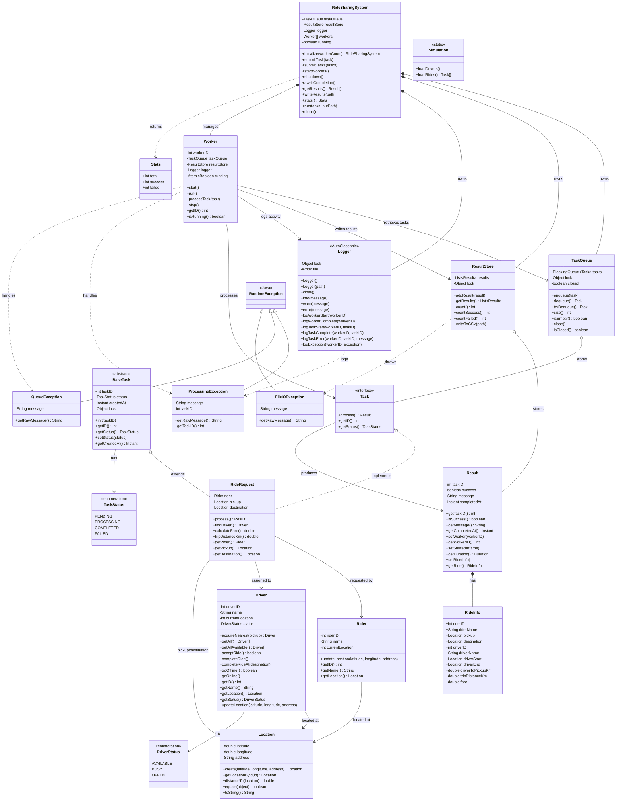

# Ride Sharing System

## Getting started (no Java installed)

### 1. Requirements
- **JDK 25** or newer (`Main.java` uses an unnamed-class `void main()` and `IO.println`, which need a recent JDK).
- **Git** (optional; you can download the project as a ZIP instead).

The project only uses Java's standard library, so there is nothing else to install.

### 2. Install Java

Download a JDK for your system from <https://adoptium.net> and follow the installer, or use a package manager:

| System | Command |
|---|---|
| macOS (Homebrew) | `brew install openjdk` |
| Windows (winget) | `winget install EclipseAdoptium.Temurin.25.JDK` |
| Ubuntu / Debian | `sudo apt install openjdk-25-jdk` (may be an older version than required; if so use the installer from adoptium.net) |
| Linux (manual) | extract the `.tar.gz` to `/opt/jdk` and add `export PATH=$PATH:/opt/jdk/bin` to your shell profile |

Open a **new terminal** and check it works:

```
java -version
javac -version
```

### 3. Get the code

```
git clone <repository-url>
cd multi_thread_data_java
```

(or download the ZIP, extract it and open a terminal in that folder).

### 4. Run it

There is no build tool, so compile all sources from the project root and run `Main`:

```
javac -d out $(find src -name '*.java')
java -cp out Main
```

On Windows PowerShell use `javac -d out (Get-ChildItem src -Recurse -Filter *.java).FullName`.

### 5. What you should see

- Console: `loaded ... drivers`, `loaded ... riders / ride requests`, a stream of worker/task log lines, and a final line like
  `done in 8100ms: 500 total, 500 successful, 0 failed (results in results.csv)`.
- New files in the project folder: `results.csv` (one row per task, see columns below) and `ridesharing.log` (the same log lines).

### 6. Optional checks

```
javac -Xlint:all -d out $(find src -name '*.java')   # compiler warnings
```

### 7. Troubleshooting

| Problem | Fix |
|---|---|
| `java: command not found` | Java is not on your `PATH`; reinstall or add it, then open a new terminal |
| `class file version` / `invalid source release` | Your JDK is too old; install JDK 25 or newer |
| `package ridesharing... does not exist` | Compile all sources together, from the project root, as shown above |
| `Drivers.csv` / `Riders.csv` not found | They must be placed in `src/ridesharing/simulation/` (and be available on the classpath when running) |

## Class Diagram



## Implementation (Java)

### Run

See [Getting started](#getting-started-no-java-installed); the commands are `javac -d out $(find src -name '*.java')` and `java -cp out Main`.

Outputs: console summary, `results.csv` (one row per task) and `ridesharing.log` (worker/task start, completion and errors).

### Data

`Drivers.csv` and `Riders.csv` live in `src/ridesharing/simulation/` and are read by `Simulation`.
Each row of `Riders.csv` is a rider **and** its ride request: the pickup is the rider's own
`latitude/longitude/address`, the destination comes from the `destination_*` columns.
Coordinates are worldwide, so distances and fares are large; this is only demo data.

### Flow

1. `Simulation.loadDrivers()` registers every driver; `Simulation.loadRides()` registers every rider and returns one `RideRequest` per rider.
2. `RideSharingSystem.initialize(workers)` creates the queue, result store, logger and workers.
3. `run` starts the workers (one thread each), enqueues all tasks, closes the queue and waits for the workers to finish.
4. Each worker dequeues a task, processes it (simulated 50-200 ms delay, reserves a free driver, computes the fare with the haversine distance), stores the `Result` and logs it.
5. Results are written to `results.csv`.

### Concurrency design

| Requirement | Where |
|---|---|
| Shared queue | `ridesharing/queue/TaskQueue.java`: bounded `ArrayBlockingQueue`; each task goes to exactly one worker |
| Worker threads | `ridesharing/worker/Worker.java`: one thread per worker, joined in `awaitCompletion()` |
| Simulated work | `ridesharing/task/RideRequest.java`: `process()` sleeps a random 50-200 ms |
| No races on shared data | `synchronized` blocks in `ResultStore`, `Logger`, the driver registry and the location list; `AtomicBoolean` for the worker running flag |
| No deadlock / safe termination | queue is closed after submitting; `dequeue` throws a `QueueException` once it is closed and drained, so every worker exits and the threads can be joined |
| No lost or duplicated tasks | the blocking queue delivers each task once; a worker that throws still stores a failed result |
| Error handling | `ridesharing/exception`: `ProcessingException`, `QueueException`, `FileIOException` (all `RuntimeException`); try/catch in the worker and try-with-resources to close files |
| Logging | `ridesharing/logger/Logger.java`: worker start/complete, task start/complete/error, exceptions; to console and `ridesharing.log` |

### `results.csv` columns

| Column | Meaning |
|---|---|
| `task_id`, `worker_id` | the task and the worker (thread) that processed it |
| `rider_id`, `rider_name` | the rider; `rider_id` is the `id` in `Riders.csv` |
| `pickup_lat/lon/address` | the rider's initial location (pickup) |
| `dest_lat/lon/address` | the ride destination |
| `driver_id`, `driver_name` | the assigned driver; `driver_id` is the `id` in `Drivers.csv` (empty if none was available) |
| `driver_start_lat/lon/address` | where the driver was when assigned |
| `driver_end_lat/lon/address` | where the driver ended the ride (the destination) |
| `driver_to_pickup_km`, `trip_distance_km`, `fare` | straight-line distances (haversine) and the fare |
| `success`, `message` | outcome and a short description |
| `started_at`, `completed_at`, `duration_ms` | timing of the task |

Rows are in completion order, so they also show how the workers interleave. A driver that never appears in `driver_id` was never picked.
